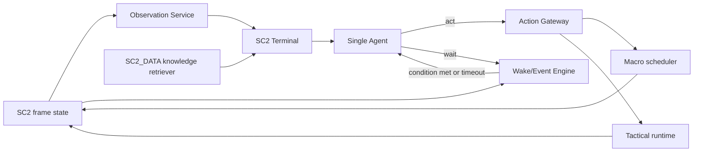

# SC2_Agent：终端式单 Agent 改造方案

## 1. 目标

将当前依赖策略 MD `[Step N]`、Naming / Ordering / Executor 多阶段 LLM 流水线的框架，改造成一个工具调用式 SC2 Agent。

- 策略 MD 只保留 `# Summary`，提供阵容、节奏、转型和风险偏好的宏观指导；删除逐 step 指令。
- Agent 通过受控的 `observe`、`knowledge.lookup`、`act`、`wait` 接口和 SC2 环境交互。
- Agent 决定正常决策频率与唤醒条件，不再要求当前策略 step 的全部动作完成后才进入下一轮决策。
- Agent 只决定 action / 意图与参数，不选择具体执行单位；Sharpy/python-sc2 负责单位选择、目标选择和实际微操。
- 保留规则执行层对资源、科技前置、人口、冷却、冲突和执行失败的校验。

## 2. 现有架构基线

当前入口为 `dummies/generic/universal_llm_bot.py` 的 `UniversalLLMBot`：

```text
Top_agent_<enemy_race>.md 的 [Step N]
  -> Naming Agent
  -> entity -> action 映射
  -> Ordering Agent
  -> Supply Planner
  -> ExecutionScheduler
```

`ExecutionScheduler` 已经提供可复用的能力：资源/人口预留、科技前置检查、等待动作、部分同优先级超车、DirectBuild 和动作状态跟踪。改造应保留该执行底座。

当前 `MACRO_POLL_INTERVAL` 被用于观测记录间隔；`pre_step_execute()` 的实际 LLM 决策主要由首次执行、队列 drain 或只剩 deferred 动作触发。因此新架构应显式实现独立的事件/等待机制，而不是继续依赖 step drain。

`strategy_tools.py` 当前被限制为不消耗 minerals/gas/supply 的后台行为，`Repair` 等资源相关功能被排除。这一限制应由新的统一资源仲裁机制替代。

## 3. 目标架构



系统运行分为两个不同频率的循环：

1. **每帧规则循环**：观测增量、执行 scheduler、运行已启用的微操策略、评估 wait 条件。不调用 LLM。
2. **Agent 决策循环**：仅在 Agent 指定的条件成立、等待到期或必要的运行安全超时后调用。模型一次可以查询上下文、下达多个动作并再次 `wait`。

推理必须与游戏帧循环隔离：游戏线程采样不可变快照并继续运行；LLM 的异步返回必须经由当前状态重新校验。过期的响应应标记 `stale` 或拒绝，不能按旧状态直接下令。

## 4. 终端工具契约

Agent 对外只能使用下列工具，不能执行任意 Python：

| Tool | 作用 |
| --- | --- |
| `observe(profile, scope)` | 获取摘要、战略、战术、区域聚焦或自上轮以来的差分。 |
| `knowledge.lookup(query)` | 查询单位关系、counter、协同、科技前置、成本与说明。 |
| `act(commands)` | 提交生产、即时战术动作，或更新持续策略。 |
| `wait(condition, max_seconds)` | 设置下一次 Agent 唤醒条件。 |

建议 Agent 最终输出采用如下结构：

```json
{
  "commands": [
    {
      "op": "enqueue",
      "action": "BARRACKSTRAIN_MARINE",
      "quantity": 4,
      "priority": "normal"
    },
    {
      "op": "configure_policy",
      "policy": "zone_attack",
      "enabled": true,
      "params": {
        "start_power": 28,
        "retreat_when": "unfavorable_fight",
        "target": "enemy_natural"
      }
    },
    {
      "op": "invoke",
      "action": "REPAIR_DAMAGED_MECHANICAL",
      "params": {
        "scope": "threatened_base",
        "max_scvs": 4,
        "min_health_ratio": 0.72,
        "mineral_budget": 75
      }
    }
  ],
  "wait": {
    "max_seconds": 12,
    "wake_on": [
      {"type": "action_state_changed"},
      {"type": "enemy_enters_our_zone"},
      {"type": "combat_health_below", "ratio": 0.55}
    ]
  }
}
```

每个提交动作都应返回一个 handle，并拥有统一状态机：`accepted -> waiting -> issued -> running -> completed | failed | cancelled | stale`。

## 5. 分层观测

现有观测应从单一英文文本扩展为版本化的结构化 `ObservationService`，同时保留旧 recorder 输出以维持记录兼容。

| Profile | 默认用途 | 内容 |
| --- | --- | --- |
| `summary` | 每次唤醒 | 时间、矿气人口、生产/研究、动作 handle、告警、启用策略、地图概况。 |
| `strategic` | 宏观转型 | 基地、采集、产能、科技、双方构成、敌情新鲜度、战力与损失。 |
| `tactical` | 交战/受袭 | 每个战区的兵种、数量、平均/最低血量、护盾、能量、冷却、距离和威胁等级。 |
| `focus` | Agent 请求 | `main`、`natural`、`army_main`、`enemy_natural`、`active_combat` 等指定区域。 |
| `delta` | 节省 token | 资源变化、死亡、完成、敌军新出现、战况和动作状态变化。 |

规则：

- 己方详情以区域/编队/单位类型聚合为默认形式，仅列出高风险个体。
- 敌方精确细节仅来自当前可见单位；战争迷雾信息必须附 `last_seen_at` 和置信度。
- 默认不向 Agent 暴露单位 tag；Agent 不负责点选单位。
- 细粒度战术 block 只在告警、战斗、低血事件或显式 `focus` 请求时发送。

## 6. 动作与微操目录

建立三个并列目录，并使用共享资源仲裁器。

| 目录 | 示例 | 生命周期 | Agent 操作 |
| --- | --- | --- | --- |
| Macro Action Catalog | 建造、训练、研究、变形、SupplyDepot | 有完成条件 | enqueue / cancel / reprioritize |
| Tactical Action Catalog | repair、scan、mule、短时侦察、主动技能 | 一次或短时 | invoke + 参数 |
| Tactical Policy Catalog | attack、defense、gather、scout、撤退逻辑 | 持续 | enable / disable / update params |

### 6.1 资源与冲突

新增 `ResourceArbiter`，统一处理：

- 宏观动作：minerals、vespene、supply。
- Repair：minerals、worker-time、最大 SCV 数。
- Scan/Mule：Orbital energy。
- 持续策略：区域或主力部队的控制权锁，避免相互矛盾的 attack/retreat 同时覆盖。

`SupplyDepot` 仍只属于 Macro Action Catalog；不能因为新增战术目录而重复管理补给。

### 6.2 Repair 的处理

将现有硬编码的 `Repair` 封装为显式 `REPAIR_DAMAGED_MECHANICAL` 战术 action。参数应包括：

- `scope`：受袭基地、主力、所有己方区域等；
- `min_health_ratio`：触发阈值；
- `max_scvs`：最多分配 SCV 数；
- `priority_targets`：Bunker、Townhall、机械单位、建筑等；
- `mineral_budget`：单次/持续预算；
- `duration` 或结束条件。

底层仍由代码决定具体 SCV 与 repair 目标。类似地，`CallMule`、`ScanEnemy` 应变为显式战术 action，而非固定策略后台副作用。

## 7. 事件与 wait

第一版支持受限且可验证的谓词，支持 `all_of` / `any_of`：

- `after_seconds`
- `action_state_changed` / `action_completed` / `action_failed`
- `resource_at_least` / `supply_left_below`
- `building_or_research_completed`
- `enemy_enters_zone` / `enemy_new_type_seen` / `enemy_cloak_detected`
- `own_zone_under_attack`
- `combat_health_below` / `army_power_ratio_changed`
- `unit_or_structure_destroyed`
- `policy_state_changed`

`max_seconds` 应有上限（建议 15 秒）。该上限只避免网络、模型或谓词错误导致无限失明；它不替 Agent 决定战略。

## 8. 策略 MD 与知识库

### 8.1 策略文件

每个 `Top_agent_<enemy_race>.md` 迁移为仅含 `# Summary` 的文档，建议包含：

- 主要兵种和科技路线；
- 开局、中期、后期的风格偏好；
- 已知敌方路线下的转型原则；
- 经济、扩张、压制的优先级；
- 风险偏好和明确禁止项。

不再保留 `[Step N]`，不再把策略文本作为精确 action 清单。动态 observation、动作状态和知识检索才是每轮 action 的依据。

### 8.2 `data_sc2_260701`

`C:\code\SC2_Agent_add_knowledge\SC2_DATA_Agent\data_sc2_260701` 应作为只读、按需检索知识源，而非整份 JSON 注入 prompt。它包含 Ability/Unit/Upgrade、SubOntology、counter、协同、科技关系和可定位 markdown 证据。

新增检索器应支持：

- 针对敌我单位的 counter / synergy 查询；
- action 的成本、前置、产物与生产者；
- 单位技能、能量和攻击属性；
- 对新侦察单位的风险摘要。

数据路径应配置化，优先使用新数据集，同时保留仓库内旧图谱作为回归实验 fallback。

## 9. 建议的代码结构

避免继续把新系统堆入 `universal_llm_bot.py`，新增：

```text
SC2_Agent/agent_runtime/
  observation_service.py
  event_engine.py
  terminal.py
  protocol.py
  session.py
  action_catalog.py
  tactical_catalog.py
  policy_catalog.py
  resource_arbiter.py
  knowledge_retriever.py
```

保留并逐步适配：

- `SC2_Agent/execution/scheduler.py`：生产、建造、研究与资源预约底座。
- `SC2_Agent/execution/mapping.py`：canonical action 到 python-sc2 / Sharpy 映射。
- `sharpy/managers/extensions/llm_observation_recorder.py`：拆出可复用抽取器，旧记录格式兼容。
- `SKILL/<race>/<strategy>/Top_agent_*.md`：summary-only 策略指引。
- `strategy_tools.py`：逐步迁移为通用 tactical action/policy 的底层实现来源。

第一阶段新增 `--decision-mode agent`，与既有 `three-stage`、`two-stage`、`bo-list` 并存；验证完成后再决定是否移除旧路径。

## 10. 实施顺序与验收

1. **冻结契约与样本**：确定 observation、action、wait schema；从现有对局记录抽取宏观、受袭、交战、转型样本。
2. **观测与事件层**：实现 profiles、focus、delta 和无 LLM 的 wake 条件测试。
3. **动作与资源层**：迁移 Macro action，随后迁移 Repair、Scan、Mule，再将 Attack/Defense/Gather/Scout 参数化为 policy。
4. **单 Agent 运行时**：接入异步模型请求、schema 校验、过期结果处理、会话摘要与完整轨迹。
5. **策略/知识迁移**：将 MD 压缩为 Summary，接入新数据集按需检索。
6. **对局验证**：先做 fake-SC2/unit tests，再做短局 smoke test，最后多地图、多对手与策略对照。

验收指标除胜率外，还应包括：决策次数、平均 token、动作拒绝率、响应过期率、资源浮存、人口阻塞率、Repair/Scan/Mule 有效率，以及“未等宏观生产完成即对受袭作出正确反应”的事件覆盖率。

